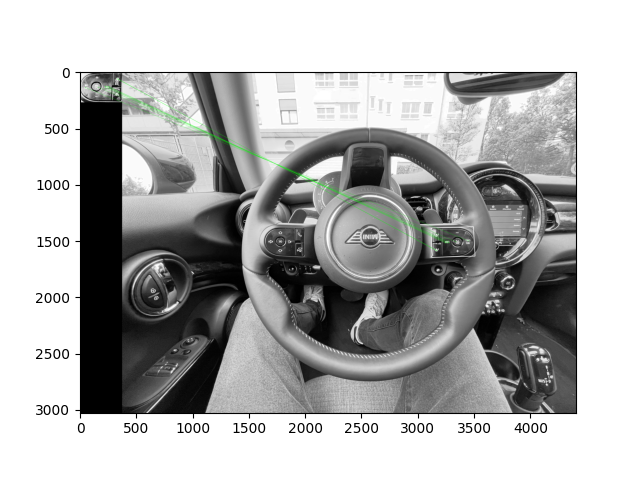

# steering-detection
This repo is an overview of approaches to detect steering angle using external optic sensors as part of my master's thesis.

In [MA_Overview Presentation](MA_Overview_23_11_06.pptx) the current progress and future steps are displayed.

*Requirements*:  [Software and Hardware Requirements](RequirementsSWHW.pdf) 

*Timeline*:  [Timeline of Master's Thesis](Timeline_MA.pdf)

## Sensors
- [ ] Interieur-camera
- [x] External camera
- [x] Structured-Light scanner
- [ ] External LiDAR
- [ ] Combination

Overview of pros and cons of sensors can be seen in the [Sensor Evaluation](SensorEvaluationMindMap.pdf).

## External camera
Currently a view approaches using an external camera in combination with OpenCV and [YoloV8](https://github.com/ultralytics/ultralytics.git) are being invastigated.

### OpenCV
In the [Repo](https://github.com/jubo99/steering-detection-frontal.git) template matching is being looked at. Template matching allows to search an image for a certain template (e.g. buttons on steering, markings).

### Yolo
The newest version of Yolo (You only look once) can also be used to detect steering (angle). Therefore, it got trained with custom data to perform detection and segmentation task on images of steering wheels.

**Detection**
- Trained on dataset with around 850 images
- Nano version of YoloV8 (smallest version)
- Weights in Yolov8_custom_weights folder

To run, execute following steps in Python3 environment:
1. Download weights
2. `pip install ultralytics`
3. `yolo predict model=detection_nano_wheel.pt source=PATH/TO/IMAGE`

*put image of results here*

**Segmentation**
- Trained with custom dataset with around 50 images (Very view images for training -> more images will most certainly increase quality dramaticly)
- Small version used for training (2nd smallest version)
- Weights in Yolov8_custom_weights folder

To run, execute following steps in Python3 environment:
1. Download weights
2. `pip install ultralytics`
3. `yolo segment predict model=seg-m-wheel-02.pt source=PATH/TO/IMAGE`

Results can be seen in the [Yolo_Segmenttation file](Yolo_Segmentation.pdf)

**Original Video**

https://github.com/jubo99/steering-detection/assets/65410490/e785a577-1cc6-4c5e-b588-1831d6116baf

**Processed Video (Angle is to be converted, ]0; 180])**

https://github.com/jubo99/steering-detection/assets/65410490/dd4d4ba4-d54b-42cc-af41-f23918d31072

### Structured-light 3D scanner (iPhone FaceID)

Scan of steering wheel using TrueDepth camera of iPhone 13.

Format: .ply (point cloud)

https://github.com/jubo99/steering-detection/assets/65410490/38b87ecc-5c7a-4a1c-8fb8-915f53174a28

**Cropped out and down sampled steering:**

**PCA of Point cloud (Dimension reduction):**

Downsampled Version:

